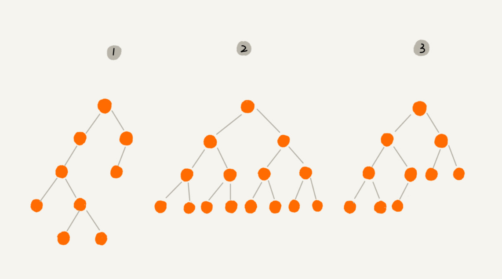

# 二叉树 

## 树（Tree）


树的三个概念：高度（Height）、深度（Depth）、层（Level）。它们的定义是这样的：

- 节点的高度：节点到叶子节点的**最长路径（边数）**
- 节点的深度：根节点到这个节点所经历的边的个数
- 节点的层数：节点的深度+1
- 树的高度：根节点的高度


记这几个概念，我还有一个小窍门，就是类比“高度”“深度”“层”这几个名词在生活中的含义。

在我们的生活中，“高度”这个概念，其实就是从下往上度量，比如我们要度量第 10 层楼的高度、第 13 层楼的高度，起点都是地面。所以，树这种数据结构的高度也是一样，从最底层开始计数，并且计数的起点是 0。

“深度”这个概念在生活中是从上往下度量的，比如水中鱼的深度，是从水平面开始度量的。所以，树这种数据结构的深度也是类似的，从根结点开始度量，并且计数起点也是 0。

“层数”跟深度的计算类似，不过，计数起点是 1，也就是说根节点的位于第 1 层。

## 二叉树（Binary Tree）

二叉树，顾名思义，每个节点最多有两个“叉”，也就是两个子节点，分别是**左子节点**和**右子节点**。不过，二叉树并不要求每个节点都有两个子节点，有的节点只有左子节点，有的节点只有右子节点。



其中，编号 2 的二叉树中，叶子节点全都在最底层，除了叶子节点之外，每个节点都有左右两个子节点，这种二叉树就叫作**满二叉树**。

编号 3 的二叉树中，叶子节点都在最底下两层，最后一层的叶子节点都靠左排列，并且除了最后一层，其他层的节点个数都要达到最大，这种二叉树叫作**完全二叉树**。

### 二叉树的存储

想要存储一棵二叉树，我们有两种方法，一种是基于指针或者引用的二叉链式存储法，一种是基于数组的顺序存储法。

- **链式存储法**

    链式存储法比较简单、直观。每个节点有三个字段，其中一个存储数据，另外两个是指向左右子节点的指针。我们只要拎住根节点，就可以通过左右子节点的指针，把整棵树都串起来。这种存储方式我们比较常用。大部分二叉树代码都是通过这种结构来实现的。

    

- **顺序存储法**

    再来看基于数组的顺序存储法，我们把根节点存储在下标 `i = 1` 的位置，那左子节点存储在下标 `2 * i = 2` 的位置，右子节点存储在 `2 * i + 1 = 3` 的位置。以此类推，B 节点的左子节点存储在 `2 * i = 2 * 2 = 4` 的位置，右子节点存储在 `2 * i + 1 = 2 * 2 + 1 = 5` 的位置。

    

    如果节点 X 存储在数组中下标为 `i` 的位置，下标为 `2 * i` 的位置存储的就是左子节点，下标为 `2 * i + 1` 的位置存储的就是右子节点。反过来，下标为 `i/2` 的位置存储就是它的父节点。通过这种方式，我们只要知道根节点存储的位置（一般情况下，为了方便计算子节点，根节点会存储在下标为 1 的位置），这样就可以通过下标计算，把整棵树都串起来。

### 二叉树的遍历

二叉树的遍历有三种经典的算法：**前序遍历**、**中序遍历**和**后序遍历**。其中，前、中、后序，表示的是节点与它的左右子树节点遍历打印的先后顺序。


**二叉树的前、中、后序遍历就是一个递归的过程**。比如，前序遍历，其实就是先打印根节点，然后再递归地打印左子树，最后递归地打印右子树。

- 前序遍历是指，对于树中的任意节点来说，先打印这个节点，然后再打印它的左子树，最后打印它的右子树。

    ```go
    func preOrder(root *Node) {
        if root == nil {
            return 
        }

        print(root)
        preOrder(root.left)
        preOrder(root.right)
    }
    ```

- 中序遍历是指，对于树中的任意节点来说，先打印它的左子树，然后再打印它本身，最后打印它的右子树。

    ```go
    func inOrder(root *Node) {
        if root == nil {
            return 
        }

        inOrder(root.left)
        print(root)
        inOrder(root.right)
    }
    ```

- 后序遍历是指，对于树中的任意节点来说，先打印它的左子树，然后再打印它的右子树，最后打印这个节点本身。

    ```go
    func postOrder(root *Node) {
        if root == nil {
            return 
        }

        postOrder(root.left)
        postOrder(root.right)
        print(root)
    }
    ```

- 这里还有一种二叉树的遍历方式，那就是按层遍历，按层遍历可以借助队列这样一个辅助数据结构。（其实也可以不用，这样就要自己手动去处理节点的关系，代码不太好理解，好处就是空间复杂度是O(1)。不过用队列比较好理解，缺点就是空间复杂度是O(n)）。根节点先入队列，然后队列不空，取出对头元素，如果左孩子存在就入列队，否则什么也不做，右孩子同理。直到队列为空，则表示树层次遍历结束。树的层次遍历，其实也是一个广度优先的遍历算法。

    ```go
    func layerPrint(root *Node) {
        queue := list.New()

        node := root
        queue.PushBack(node)

        for queue.Len() > 0 {
            node = queue.Front().Value.(*Node)
            print(node)

            if node.left != nil {
                queue.PushBack(node.left)
            }
            if node.right != nil {
                queue.PushBack(node.right)
            }
        }
    }
    ```

## 二叉查找树（Binary Search Tree）

二叉查找树是二叉树中最常用的一种类型，也叫二叉搜索树。顾名思义，二叉查找树是为了实现快速查找而生的。不过，它不仅仅支持快速查找一个数据，还支持快速插入、删除一个数据。

这些都依赖于二叉查找树的特殊结构。二叉查找树要求，在树中的任意一个节点，其左子树中的每个节点的值，都要小于这个节点的值，而右子树节点的值都大于这个节点的值。


- **二叉查找树的查找**

    

- **二叉查找树的插入**
- **二叉查找树的删除**