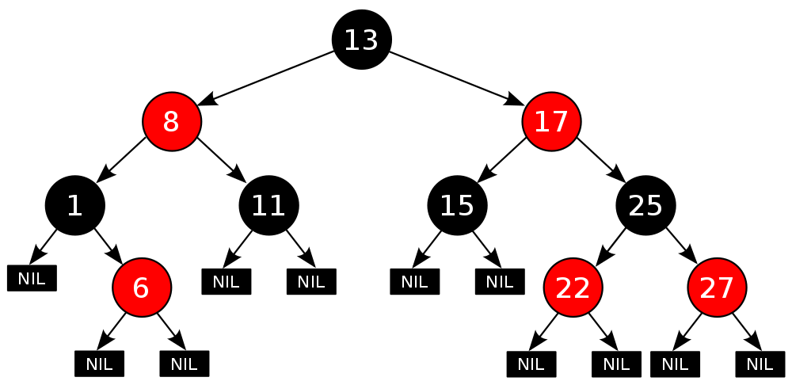
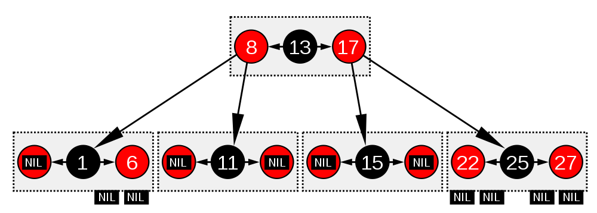

# 红黑树

- [红黑树](#红黑树)
  - [红黑树的定义](#红黑树的定义)
  - [红黑树的实现](#红黑树的实现)
    - [红黑树的插入操作](#红黑树的插入操作)
    - [红黑树的删除操作](#红黑树的删除操作)

## 红黑树的定义

红黑树的英文是“Red-Black Tree”，简称 R-B Tree。它是一种不严格的平衡二叉查找树，它的定义是不严格符合平衡二叉查找树的定义的。

红黑树中的节点，一类被标记为黑色，一类被标记为红色。除此之外，一棵红黑树还需要满足这样几个要求：

- 根节点是黑色的；
- 每个叶子节点都是黑色的空节点（NIL），也就是说，叶子节点不存储数据；
- 任何相邻的节点都不能同时为红色，也就是说，红色节点是被黑色节点隔开的；
- 每个节点，从该节点到达其可达叶子节点的所有路径，都包含相同数目的黑色节点；



红黑树在结构上类似于有序的B树，其中每个节点可以包含1到3个值和2到4个子节点。在这样的B树中，每个节点只包含一个与红黑树中一个黑节点的值匹配的值，在同一个节点中，在它的前面和/或后面都有一个可选的值，两者都匹配红黑树中一个等效的红节点。

看到这种等价性的一种方法是“向上移动”红黑树的图形表示中的红节点，通过创建一个水平集群，使它们与它们的父黑节点水平对齐。在B树中，或者在修改后的红黑树图形表示中，所有叶节点都在相同的深度。



## 红黑树的实现

基本的数据结构与操作

```go
// RBNode is red-black tree rb-node
type RBNode struct {
	parent, left, right *RBNode
	color               bool
	data                int
}

// RBTree is a red-black tree implemention
type RBTree struct {
	root *RBNode
	size int
}

func parent(rbn *RBNode) *RBNode {
	if rbn == nil {
		return nil
	}
	return rbn.parent
}

func grandParent(rbn *RBNode) *RBNode {
	return parent(parent(rbn))
}

func sibling(rbn *RBNode) *RBNode {
	p := parent(rbn)
	if p == nil {
		return nil
	}

	if p.left == rbn {
		return p.right
	}
	return p.left
}

func uncle(rbn *RBNode) *RBNode {
	return sibling(parent(rbn))
}
```

红黑树的平衡过程跟魔方复原非常神似，大致过程就是：遇到什么样的节点排布，我们就对应怎么去调整。只要按照这些固定的调整规则来操作，就能将一个非平衡的红黑树调整成平衡的。

红黑树两个非常重要的操作，左旋（rotate left）、右旋（rotate right）。操作的过程可以结合下图和代码更容易理解


具体的代码实现如下

- **左旋**

    ```go
    // RotateLeft by specified node
    func rotateLeft(node *RBNode) {
        newNode := node.right
        p := parent(node)
        if newNode == nil {
            return
        }

        node.right = newNode.left
        newNode.left = node
        node.parent = newNode
        if node.right != nil {
            node.right.parent = node
        }

        if p != nil {
            if node == p.left {
                p.left = newNode
            } else {
                p.right = newNode
            }
        }
        newNode.parent = p
    }
    ```

- **右旋**
    ```go
    // RotateRight by specified node
    func rotateRight(node *RBNode) {
        newNode := node.left
        p := parent(node)
        if newNode == nil {
            return
        }

        node.left = newNode.right
        newNode.right = node
        node.parent = newNode
        if node.left != nil {
            node.left.parent = node
        }

        if p != nil {
            if node == p.left {
                p.left = newNode
            } else {
                p.right = newNode
            }
        }
        newNode.parent = p
    }
    ```

红黑树的插入、删除操作会破坏红黑树的定义，具体来说就是会破坏红黑树的平衡，所以，我们现在就来看下，红黑树在插入、删除数据之后，如何调整平衡，继续当一棵合格的红黑树的。

### 红黑树的插入操作

红黑树规定，插入的节点必须是红色的。而且，二叉查找树中新插入的节点都是放在叶子节点上。所以，关于插入操作的平衡调整，有这样两种特殊情况，但是也都非常好处理。
- 如果插入节点的父节点是黑色的，那我们什么都不用做，它仍然满足红黑树的定义。
- 如果插入的节点是根节点，那我们直接改变它的颜色，把它变成黑色就可以了。

除此之外，其他情况都会违背红黑树的定义，于是我们就需要进行调整，调整的过程包含两种基础的操作：**左右旋转**和**改变颜色**。

红黑树的平衡调整过程是一个迭代的过程。我们把正在处理的节点叫作关注节点。关注节点会随着不停地迭代处理，而不断发生变化。最开始的关注节点就是新插入的节点。

- **插入操作**

    ```go
    // Insert a value to red-black tree
    func (rbt *RBTree) Insert(value int) {
        newNode := &RBNode{color: RED, data: value}
        node := rbt.root

        // Insert
        for node != nil {
            if value < node.data {
                if node.left == nil {
                    newNode.parent = node
                    node.left = newNode
                }
                node = node.left
            } else if value > node.data {
                if node.right == nil {
                    newNode.parent = node
                    node.right = newNode
                }
                node = node.right
            } else {
                break
            }
        }

        // Repair the tree
        insertRepairTree(node)

        // Find the new root
        root := node
        for root.parent != nil {
            root = root.parent
        }
        rbt.root = root
    }
    ```

新节点插入之后，如果红黑树的平衡被打破，那一般会有下面三种情况。我们只需要根据每种情况的特点，不停地调整，就可以让红黑树继续符合定义，也就是继续保持平衡。

- 调整平衡

    ```go
    // Repair the tree, return the new root
    func insertRepairTree(node *RBNode) {

    }
    ```

下面依次来看每种情况的调整过程，为了简化描述，我们把父节点的兄弟节点叫作叔叔节点，父节点的父节点叫作祖父节点。

**CASE 1：如果关注节点是 a，它的叔叔节点 d 是红色**，我们就依次执行下面的操作：
  - 将关注节点 a 的父节点 b、叔叔节点 d 的颜色都设置成黑色；
  - 将关注节点 a 的祖父节点 c 的颜色设置成红色；
  - 关注节点变成 a 的祖父节点 c；
  - 跳到 CASE 2 或者 CASE 3。


- 代码实现
    ```go
    func insertCase1(node *RBNode) {

    }
    ```

**CASE 2：如果关注节点是 a，它的叔叔节点 d 是黑色，关注节点 a 是其父节点 b 的右子节点**，我们就依次执行下面的操作：
  - 关注节点变成节点 a 的父节点 b；
  - 围绕新的关注节点b 左旋；
  - 跳到 CASE 3。


- 代码实现
    ```go
    func insertCase2(node *RBNode) {

    }
    ```

**CASE 3：如果关注节点是 a，它的叔叔节点 d 是黑色，关注节点 a 是其父节点 b 的左子节点**，我们就依次执行下面的操作：
  - 围绕关注节点 a 的祖父节点 c 右旋；
  - 将关注节点 a 的父节点 b、兄弟节点 c 的颜色互换。
  - 调整结束。


- 代码实现
    ```go
    func insertCase3(node *RBNode) {

    }
    ```

### 红黑树的删除操作

