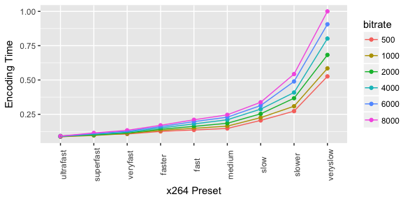

# FFmpeg CLI 工具的使用

- [FFmpeg CLI 工具的使用](#ffmpeg-cli-工具的使用)
  - [ffmpeg](#ffmpeg)
    - [详细参数说明](#详细参数说明)
  - [ffplay](#ffplay)
    - [快捷键](#快捷键)
    - [选项](#选项)
  - [ffprobe](#ffprobe)
  - [ffmpeg使用](#ffmpeg使用)
    - [H.264 视频编码](#h264-视频编码)
      - [Constant Rate Factor (CRF)](#constant-rate-factor-crf)
      - [Two-Pass ABR](#two-pass-abr)
      - [H.264 无损编码](#h264-无损编码)
      - [进一步调整预设的设置](#进一步调整预设的设置)
      - [其它有用信息](#其它有用信息)
        - [CBR (Constant Bit Rate)](#cbr-constant-bit-rate)
        - [Constrained encoding (VBV / maximum bit rate)](#constrained-encoding-vbv--maximum-bit-rate)
        - [低延迟](#低延迟)
        - [快速测试有用的设置](#快速测试有用的设置)
        - [Web视频的 `faststart`](#web视频的-faststart)
      - [常见问题](#常见问题)
    - [AAC 音频编码](#aac-音频编码)
    - [Streaming](#streaming)
- [参考资料](#参考资料)

## ffmpeg

ffmpeg是用于转码的应用程序。一个简单的转码命令可以这样写：

```shell
# 将input.avi转码成output.ts，并设置视频的码率为640kbps
$ ffmpeg -i input.avi -b:v 640k output.ts
```

### 详细参数说明

**通用选项**
```shell
-L                  license
-h                  帮助
-fromats            显示可用的格式，编解码的，协议的...
-f fmt              强迫采用格式fmt
-i filename         输入文件
-y                  覆盖输出文件
-t duration         设置纪录时间 hh:mm:ss[.xxx]格式的记录时间也支持
-ss position        搜索到指定的时间 [-]hh:mm:ss[.xxx]的格式也支持
-title string       设置标题
-author string      设置作者
-copyright string   设置版权
-comment string     设置评论
-target type        设置目标文件类型(vcd,svcd,dvd)所有的格式选项（比特率，编解码以及缓冲区大小）自动设置，只需要输入如下的就可以了：ffmpeg -i myfile.avi -target vcd /tmp/vcd.mpg
-hq                 激活高质量设置
-itsoffset offset   设置以秒为基准的时间偏移，该选项影响所有后面的输入文件。该偏移被加到输入文件的时戳，定义一个正偏移意味着相应的流被延迟了 offset秒。[-]hh:mm:ss[.xxx]的格式也支持
```

**视频选项**
```shell
-b bitrate          设置比特率，缺省200kb/s
-r fps              设置帧频 缺省25
-s size             设置帧大小 格式为WXH 缺省160X128.下面的简写也可以直接使用：Sqcif 128X96 qcif 176X144 cif 252X288 4cif 704X576
-aspect aspect      设置横纵比 4:3 16:9 或 1.3333 1.7777
-croptop size       设置顶部切除带大小 像素单位
-cropbottom size 
–cropleft size 
–cropright size
-padtop size        设置顶部补齐的大小 像素单位
-padbottom size 
–padleft size 
–padright size 
–padcolor color     设置补齐条颜色(hex,6个16进制的数，红:绿:兰排列，比如000000代表黑色)
-vn                 不做视频记录
-bt tolerance       设置视频码率容忍度kbit/s
-maxrate bitrate    设置最大视频码率容忍度
-minrate bitreate   设置最小视频码率容忍度
-bufsize size       设置码率控制缓冲区大小
-vcodec codec       强制使用codec编解码方式。如果用copy表示原始编解码数据必须被拷贝。
-sameq              使用同样视频质量作为源（VBR）
-pass n             选择处理遍数（1或者2）。两遍编码非常有用。第一遍生成统计信息，第二遍生成精确的请求的码率
-passlogfile file   选择两遍的纪录文件名为file
```

**高级视频选项**

```shell
-g gop_size                 设置图像组大小
-intra                      仅适用帧内编码
-qscale q                   使用固定的视频量化标度(VBR)
-qmin q                     最小视频量化标度(VBR)
-qmax q                     最大视频量化标度(VBR)
-qdiff q                    量化标度间最大偏差 (VBR)
-qblur blur                 视频量化标度柔化(VBR)
-qcomp compression          视频量化标度压缩(VBR)
-rc_init_cplx complexity    一遍编码的初始复杂度
-b_qfactor factor           在p和b帧间的qp因子
-i_qfactor factor           在p和i帧间的qp因子
-b_qoffset offset           在p和b帧间的qp偏差
-i_qoffset offset           在p和i帧间的qp偏差
-rc_eq equation             设置码率控制方程 默认tex^qComp
-rc_override override       特定间隔下的速率控制重载
-me method                  设置运动估计的方法 可用方法有 zero phods log x1 epzs(缺省) full
-dct_algo algo              设置dct的算法 可用的有 0 FF_DCT_AUTO 缺省的DCT 1 FF_DCT_FASTINT 2 FF_DCT_INT 3 FF_DCT_MMX 4 FF_DCT_MLIB 5 FF_DCT_ALTIVEC
-idct_algo algo             设置idct算法。可用的有 0 FF_IDCT_AUTO 缺省的IDCT 1 FF_IDCT_INT 2 FF_IDCT_SIMPLE 3 FF_IDCT_SIMPLEMMX 4 FF_IDCT_LIBMPEG2MMX 5 FF_IDCT_PS2 6 FF_IDCT_MLIB 7 FF_IDCT_ARM 8 FF_IDCT_ALTIVEC 9 FF_IDCT_SH4 10 FF_IDCT_SIMPLEARM
-er n                       设置错误残留为n 1 FF_ER_CAREFULL 缺省 2 FF_ER_COMPLIANT 3 FF_ER_AGGRESSIVE 4 FF_ER_VERY_AGGRESSIVE
-ec bit_mask                设置错误掩蔽为bit_mask,该值为如下值的位掩码 1 FF_EC_GUESS_MVS (default=enabled) 2 FF_EC_DEBLOCK (default=enabled)
-bf frames                  使用frames B 帧，支持mpeg1,mpeg2,mpeg4
-mbd mode                   宏块决策 0 FF_MB_DECISION_SIMPLE 使用mb_cmp 1 FF_MB_DECISION_BITS 2 FF_MB_DECISION_RD
-4mv                        使用4个运动矢量 仅用于mpeg4
-part                       使用数据划分 仅用于mpeg4
-bug param                  绕过没有被自动监测到编码器的问题
-strict strictness          跟标准的严格性
-aic                        使能高级帧内编码 h263+
-umv                        使能无限运动矢量 h263+
-deinterlace                不采用交织方法
-interlace                  强迫交织法编码仅对mpeg2和mpeg4有效。当你的输入是交织的并且你想要保持交织以最小图像损失的时候采用该选项。可选的方法是不交织，但是损失更大
-psnr                       计算压缩帧的psnr
-vstats                     输出视频编码统计到vstats_hhmmss.log
-vhook module               插入视频处理模块 module 包括了模块名和参数，用空格分开
```

**音频选项**
```shell
-ab bitrate                 设置音频码率
-ar freq                    设置音频采样率
-ac channels                设置通道 缺省为1
-an                         不使能音频纪录
-acodec codec               使用codec编解码
```
**音频/视频捕获选项**
```shell
-vd device                  设置视频捕获设备。比如/dev/video0
-vc channel                 设置视频捕获通道 DV1394专用
-tvstd standard             设置电视标准 NTSC PAL(SECAM)
-dv1394                     设置DV1394捕获
-av device                  设置音频设备 比如/dev/dsp
```
**高级选项**
```shell
-map file:stream            设置输入流映射
-debug                      打印特定调试信息
-benchmark                  为基准测试加入时间
-hex                        倾倒每一个输入包
-bitexact                   仅使用位精确算法 用于编解码测试
-ps size                    设置包大小，以bits为单位
-re                         以本地帧频读数据，主要用于模拟捕获设备
-loop                       循环输入流（只工作于图像流，用于ffserver测试）
```
## ffplay

ffplay是ffmpeg工程中提供的播放器，功能相当的强大，凡是ffmpeg支持的视音频格式它基本上都支持。甚至连VLC不支持的一些流媒体都可以播放（比如说RTMP），但是它的缺点是其不是图形化界面的，必须通过键盘来操作。一个简单的播放命令可以这样写：

```shell
# 播放test.avi
$ ffplay test.avi
```

### 快捷键

播放视音频文件的时候，可以通过下列按键控制视音频的播放

按键 | 作用
---|---
Q,ESC               | 退出
F                   | 全屏
P,Space             | 暂停
W                   | 显示音频波形
S                   | 逐帧显示
左方向键/右方向键   | 向后10s/向前10s
上方向键/下方向键   | 向后1min/向前1min
page down/page up   | 向后10min/向前10min
鼠标点击屏幕        | 跳转到指定位置（根据鼠标位置相对屏幕的宽度计算）

### 选项

```shell
-x width                强制屏幕宽度
-y height               强制屏幕高度
-s size                 强制屏幕大小
-fs                     全屏
-an                     关闭音频
-vn                     关闭视频
-ast stream             设置想播放的音频流（需要指定流ID）
-vst stream             设置想播放的视频流（需要指定流ID）
-sst stream             设置想播放的字幕流（需要指定流ID）
-ss second              从指定位置开始播放，单位是秒
-t time                 播放指定时长的视频
-nodisp                 无显示屏幕
-f                      强制封装格式
-pix_fmt                指定像素格式
-stats                  显示统计信息
-idct                   IDCT算法
-ec                     错误隐藏方法
-sync                   视音频同步方式（type=audio/video/ext）
-autoexit               播放完成自动退出
-exitonkeydown          按下按键退出
-exitonmousedown        按下鼠标退出
-loop count             指定循环次数
-framedrop              CPU不够的时候丢帧
-window_title           显示窗口的标题
-rdftspeed              Rdft速度
-showmode               显示方式(0 = video, 1 = waves, 2 = RDFT)
-codec                  强制解码器
```

## ffprobe

ffprobe是用于查看文件格式的应用程序。

## ffmpeg使用

### H.264 视频编码

通常建议使用两种速率控制模式：Constant Rate Factor(CRF) 或 Two-Pass ABR，速率控制决定每个帧将使用多少位，这将确定文件大小以及质量分配方式。这里不进行详述，具体可以参考 [这里](https://slhck.info/video/2017/03/01/rate-control.html)

#### Constant Rate Factor (CRF)

如果想保持最佳的质量，而且不担心文件大小，请使用此速率控制模式。对于大多数情况下，这是推荐的速率控制模式。

当输出文件的大小不太重要时，此方法允许编码器尝试为整个文件实现一定的输出质量。可以提供最大的压缩效率。通过调整每一帧的量化器，可以获得保持所需质量水平所需的比特率。缺点是您不能指定的文件的大小或限制最大文件大小和比特率，所以不建议使用此方法来编码要流式传输的视频。

1. **选择一个合适的CRF值**
   
    CRF的可选范围是`0-51`，`0`表示无损，默认值为 `23`，`51` 为最差的质量。值越小表示质量越高，理想的范围是`17-28`之间。一般情况下`17`或者`18`已经可以主观的认为接近无损了，看上去应该与输入相同或几乎相同，但从技术上还是有损的。

    该范围是指数级的，因此将CRF值 `+6` 会导致比特率/文件大小大约为原来的一半，而 `-6` 会导致比特率大约为原来的两倍。

    一般来说选择可接受质量的最高CRF值。如果输出看起来不错，可以尝试使用更高的值。如果看起来不好，选择一个较低的值。

    注意：这里提到的`0–51` CRF量化器比例仅适用于8位x264。使用10位支持进行编译时，x264的量化比例为`0-63`。你可以看到你是指的是使用的是什么ffmpeg的控制台输出编码过程中（YUV420P或8位相似，yuv420p10le或10位相似）。8位在发行商中更为常见。

2. **设置preset和tune**

    **Preset**

    `Preset` 是预设选项的集合，这些选项将提供一定的编码速度与压缩比。较慢的预设将提供更好的压缩（压缩是每个文件大小的质量）。这意味着，例如，如果您以某个文件大小或恒定比特率为目标，则使用较慢的预设可获得更好的质量。同样，对于恒定质量的编码，只需选择较慢的预设即可简单地节省比特率。

    一般来说使用可以接受的最慢的预设，以下列出了可用的预设选项：

    - `ultrafast`
    - `superfast`
    - `veryfast`
    - `faster`
    - `fast`
    - `medium` – default preset
    - `slow`
    - `slower`
    - `veryslow`
    - `placebo` – ignore this as it is not useful (see FAQ)

    也可以使用参数`-preset`查看当前预设的列表（请参见下面的示例）。如果安装了`x264`二进制可执行文件，则还可以通过运行`x264 --fullhelp`来查看这些预设适用的确切设置。

    **Tune**

    您可以选择使用`-tune`根据输入的具体信息更改设置。当前的调整包括：

    - `film`        – 用于高质量电影内容；降低解块
    - `animation`   – 适用于卡通；使用更高的解块和更多参考帧
    - `grain`       – 保留较高的颗粒感
    - `stillimage`  – 适用于类似幻灯片的内容
    - `fastdecode`  – 通过禁用某些过滤器来加快解码速度
    - `zerolatency` - 适用于快速编码和低延迟流
    - `psnr`        – 忽略它，因为它仅用于编解码器开发
    - `ssim`        – 忽略它，因为它仅用于编解码器开发

    例如，如果您输入的是动画，则使用 `animation` 调整，或者如果您想在影片中保留颗粒，则使用 `grain` 调整。如果不确定使用什么或输入的内容与任何调整都不匹配，请省略 `-tune` 选项。您可以使用 `-tune help` 查看当前支持调整的列表，以及 `x264 --fullhelp` 查看可以应用哪些设置。

    **Profile**

    使用 `-profile:v` 选项限制输出到一个特定的 `H.264` 配置。某些设备（大多数是非常旧的或过时的）仅支持有限且受约束的 `baseline` 或 `main` 配置。您可以使用`-profile:v Baseline` 或 `-profile:v Main` 来设置配置文件。

    大多数现代设备都支持更高级的High Profile。除非您需要支持有限的设备，否则建议您忽略设置配置文件，这将使x264自动选择适当的配置文件。

    请注意，`-profile:v` 的用法与无损编码不兼容。

    列出所有可能的内部 `Preset` 和 `Tune`：

    Linux:
    ```shell
    $ ffmpeg -hide_banner -f lavfi -i nullsrc -c:v libx264 -preset help -f mp4 -
    ```
    或Windows：
    ```shell
    > ffmpeg -hide_banner -f lavfi -i nullsrc -c:v libx264 -preset help -f mp4 NUL
    ```

3. **CRF编码示例**

    下面这条命令使用更慢的预设下实现更高的压缩，从而对高质量的视频进行编码：
    ```shell
    $ ffmpeg -i input.avi -c:v libx264 -preset slow -crf 22 -c:a copy output.mkv
    ```
    在此示例中，输入文件的音频流只是简单地流复制到输出中，而不进行重新编码。

    如果您要编码一组相似的视频，请对所有视频应用相同的设置，这将确保它们的质量都相似。

#### Two-Pass ABR

如果要针对特定​​的输出文件大小，并且逐帧输出的质量不太重要，请使用此速率控制模式。最好用一个例子来解释。您的视频长度为10分钟（600秒），并且需要200 MiB的输出。那么可以得出 `比特率 = 文件大小 / 时长`：
```
(200 MiB * 8192 [converts MiB to kBit]) / 600 seconds = ~2730 kBit/s total bitrate
2730 - 128 kBit/s (desired audio bitrate) = 2602 kBit/s video bitrate
```
如果您已经知道所需的最终（平均）比特率，也可以放弃比特率计算。

**Two Pass 示例**

  对于 Two Pass，你需要运行两次 `ffmpeg`，并且设置几乎一样的参数

  - 在阶段1和2中，分别使用 `pass 1` 和 `pass 2` 选项
  - 在阶段1中，输出到空文件描述符，而不是实际的文件（这将生成ffmpeg第二阶段所需的日志文件）
  - 在阶段1中，你需要指定与阶段2将要使用的输出格式(使用 `-f`)
  - 在阶段1中，您可以通过指定 `-an` 来排除音频。

  例如：
  ```shell
  ffmpeg -y -i INPUT -c:v libx264 -b:v 2600k -pass 1 -an -f mp4 /dev/null && \
  ffmpeg -i INPUT -c:v libx264 -b:v 2600k -pass 2 -c:a aac -b:a 128k output.mp4
  ```
  > Windows 系统下使用 `NUL` 替换 `/dev/null`，使用 `^` 替换 `\`

  与CRF一样，选择您可以忍受的最慢的预设，并可选地应用 `-tune` 设置和 `-profile:v`。

  `Two Pass` 并不一定会提供比 CRF 更好的质量，尽管它让您更准确的锁定文件的大小

#### H.264 无损编码

你可以使用 `-crf 0` 来创建无损视频，有两个有用的预设是 `ultrafast` 和 `veryslow`，因为快速编码速度或最佳压缩通常是最重要的因素

快速编码示例：
```shell
ffmpeg -i INPUT -c:v libx264 -preset ultrafast -crf 0 output.mkv
```

最佳压缩示例：
```shell
ffmpeg -i INPUT -c:v libx264 -preset veryslow -crf 0 output.mkv
```
无损输出的文件可能会很大，并且大多数非基于FFmpeg的播放器将无法解码无损，因为，如果考虑兼容性或文件大小的问题，则不应该使用无损。

> 提示：如果想要“视觉无损”，但是在技术上并非无损的输出，请使用 -crf 值大约17或18（您必须进行实验，看看哪个值可以接受）。这很可能和源文件没有区别，并且不会像真正的无损模式那样输出那样庞大的文件，而且还可能不兼容

#### 进一步调整预设的设置

当 `-preset` 为您选择最佳设置时，您可以使用 `x264-params` 选项或使用 `libx264` 专用选项覆盖这些设置（请参阅 `ffmpeg -h encoder=libx264`）。除非您知道自己在做什么，否则不建议这样做。预设是由`x264`开发人员创建的，调整值以获得更好的输出通常是浪费时间。

例：
```shell
ffmpeg -i INPUT -c:v libx264 -preset slow -crf 22 -x264-params keyint=123:min-keyint=20 -c:a copy output.mkv
```
> 注意：不要使用 `x264opts` 选项，因为它最终会被移除，请使用 `x264-params` 替代

#### 其它有用信息

##### CBR (Constant Bit Rate)

没有本地的或真正的CBR模式，但是您可以通过调整一遍平均比特率编码器的参数来“模拟”恒定比特率设置：

```shell
ffmpeg -i input.mp4 -c:v libx264 -x264-params "nal-hrd=cbr" -b:v 1M -minrate 1M -maxrate 1M -bufsize 2M output.ts
```
在上面的示例中，`-bufsize` 是“速率控制缓冲区”，因此它将在每2 MBit的视频中强制执行您请求的“平均值”（在这种情况下为1 MBit / s）。这里假设接收者/播放器将缓冲那么多数据，这意味着该范围内的波动是可以接受的。

如果视频易于编码（例如，空帧或黑帧），则CBR编码通常效率不高。

##### Constrained encoding (VBV / maximum bit rate)

如果要限制使用的最大比特率，或将流的比特率保持在一定范围内，请使用此模式。这对于在线流特别有用，在在线流中，客户端期望一定的平均比特率，但是您仍然希望编码器调整每帧的比特率。

通过同时指定 `-maxrate` 和 `-bufsize`，可以以最大比特率 使用 `-crf` 或 `-b:v`:
```shell
ffmpeg -i INPUT -c:v libx264 -crf 23 -maxrate 1M -bufsize 2M output.mp4
```

这将有效地以 `-crf 23` 为“目标”，但如果输出超过1 MBit / s，编码器将增加CRF以防止比特率峰值。但是，请注意，libx264并不严格控制您指定的最大比特率（上述文件的最大比特率可能远远超过1M）。要达到理想的最大比特率，请使用 `Two Pass`。

在另一个示例中，代替使用恒定质量（CRF）作为目标，而是设置平均比特率。首选采用 `Two Pass` 方法：
```shell
ffmpeg -i INPUT -c:v libx264 -b:v 1M -maxrate 1M -bufsize 2M -pass 1 -f mp4 /dev/null && \
ffmpeg -i INPUT -c:v libx264 -b:v 1M -maxrate 1M -bufsize 2M -pass 2 output.mp4
```

##### 低延迟

X264提供了 `-tune zerolatency` 延迟选项，以实现低延迟的流传输。

##### 快速测试有用的设置

使用 `-ss` 和 `-t` / `-to`选项对随机部分而不是整个视频进行编码，以快速了解输出的大致情况。

- `-ss`：从开始的偏移时间。值可以是秒或HH:MM:SS格式。
- `-t`：持续时间。值可以是秒或HH:MM:SS格式。
- `-to`：在指定位置停止写入输出。值可以是秒或HH:MM:SS格式。

##### Web视频的 `faststart`

如果要在浏览器中观看视频，则 可以添加 `-movflags +faststart` 作为输出选项。这会将一些信息移到文件的开头，并允许视频在观看者完全下载之前开始播放。如果您要使用视频服务（例如YouTube），则不需要这样做。YouTube的[推荐](https://support.google.com/youtube/answer/1722171?hl=en)使用的fastStart，这样他们就可以在上传完成之前开始重新编码。

#### 常见问题

**为什么 `placebo` 浪费时间**

与 `veryslow` 的预设相比，它在质量方面的帮助最多为~1%，而编码时间要长得多。它的收益是递减的：`veryslow` 相比 `slower` 的预设质量提升约3%，`slow` 相比于 `slower` 的提升约为5%，然后 `slower` 相比于 `medium` 的提升约5-10%

**不同预设如何影响编码时间？**

这取决于源材料，目标比特率和您的硬件配置。通常，比特率越高，编码所需的时间越多。

这是一个示例，显示1080p视频的 `Two Pass` 编码的（标准化）编码时间：



从 `medium` 到 `slow` ，所需的时间由约增加40%。相反，`slower` 会导致所需时间增加大约100%（即，将花费两倍的时间）。与 `medium` 相比，`veryslow` 需要原始编码时间的280%，而质量相比 `slower` 只有很少的改进。

使用 `fast` 节省约10%的编码时间，`faster` 25%。`ultrafast` 将节省55%的成本，但质量要低得多。

**为什么我的无损输出看起来并不是无损？**

如果您的输入文件是RGB，则是RGB到YUV颜色空间的转换。使用 `-c:v libx264rgb` 代替。

**显卡会使x264编码更快吗？**

对于X264而言，可能不是。[x264支持OpenCL](https://code.videolan.org/videolan/x264/-/commit/f49a1b2ef6d95d8f0f186df0fc3bfe38414e264f)的一些先行操作。

有关受支持的硬件H.264编码器和解码器的信息，请参见[HWAccelIntro](https://trac.ffmpeg.org/wiki/HWAccelIntro)。

**播放器编码兼容性**

您可能需要使用 `-vf format=yuv420p`（或别名`-pix_fmt yuv420p`），才能在QuickTime和大多数其他播放器中使用输出。这些播放器仅支持具有H.264视频4:2:0采样的YUV色彩空间。否则，根据您的来源，ffmpeg可能会输出为可能与这些播放器不兼容的像素格式。

### AAC 音频编码

### Streaming

# 参考资料
- [[总结]FFMPEG视音频编解码零基础学习方法](https://blog.csdn.net/leixiaohua1020/article/details/15811977)
- [FFmpeg Documentation](https://ffmpeg.org/documentation.html)
- [FFmpeg Wiki](https://trac.ffmpeg.org/)
- [FFmpeg H.264 Video Encoding Guide](https://trac.ffmpeg.org/wiki/Encode/H.264)
- [FFmpeg AAC Encoding Guide](https://trac.ffmpeg.org/wiki/Encode/AAC)
- [FFmpeg Encoding for Streaming Sites](https://trac.ffmpeg.org/wiki/EncodingForStreamingSites)
- [FFmpeg Streaming Guide](https://trac.ffmpeg.org/wiki/StreamingGuide)
- [Constant Rate Factor Guide](https://slhck.info/video/2017/02/24/crf-guide.html)
- [Understanding Rate Control Modes (x264, x265, vpx)](https://slhck.info/video/2017/03/01/rate-control.html)
