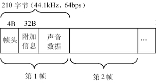
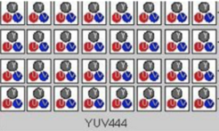

# 视音频基础

- [视音频基础](#视音频基础)
  - [音频](#音频)
    - [数字音频](#数字音频)
    - [数字音频的分类](#数字音频的分类)
    - [常见的音频格式](#常见的音频格式)
      - [WAV 音频格式](#wav-音频格式)
      - [MP3 音频格式](#mp3-音频格式)
      - [WMA 音频格式](#wma-音频格式)
      - [AAC 音频格式](#aac-音频格式)
      - [PCM](#pcm)
    - [音频相关参数](#音频相关参数)
      - [采样率](#采样率)
      - [比特率](#比特率)
  - [视频](#视频)
    - [光与颜色](#光与颜色)
      - [颜色的度量](#颜色的度量)
      - [颜色空间](#颜色空间)
        - [RGB](#rgb)
        - [HSL&HSV](#hslhsv)
        - [YUV(YCbCr)](#yuvycbcr)
        - [颜色空间的转换](#颜色空间的转换)
    - [电视制式](#电视制式)
      - [NTSC 电视标准](#ntsc-电视标准)
      - [PAL 电视标准](#pal-电视标准)
      - [SECAM 电视标准](#secam-电视标准)
    - [视频的构成](#视频的构成)
      - [封装格式](#封装格式)
      - [视频编码](#视频编码)
      - [视频编解码器](#视频编解码器)
- [参考资料](#参考资料)

## 音频

**音频**（Audio）指人能听到的声音包括语音、音乐和其它声音如环境声、音效声、自然声等。

### 数字音频

数字音频是指使用数字编码的方式也就是使用 0 和 1 来记录音频信息，它是相对于模拟音频来说的。

> 在 CD 光盘和计算机技术未出现之前都是模拟音频（如录音带），其中数字/模拟转换器简称：DAC、模拟/数字转换器简称：ADC.

我们知道声音可以表达成一种随着时间的推移形成的一种波形：

<p style="text-align: center;"></p>

但是如果想要直接描述这样的一个曲线存储到计算机中，是没有办法描述的。假如描述也只能是这样表达：曲线下去了，上去了，又下去了，又上去了，显然这样是很不合理的。

不过我们可以把这些电平信号转化成二进制数据保存，播放的时候就把这些数据转换为模拟的电平信号再送到喇叭播出，就可以了。

用专业的术语来说，我们每两次测一下位置的时间间隔，就是所谓的**采样率**。采样率等于多少，就意味着我们每秒钟进行了多少次这样的测量。所谓音质，就是指最后我们描述这个曲线的数字，到底和真实的曲线误差有多大。

数字声音和一般磁带、广播、电视中的声音就存储播放方式而言有着本质区别。相比而言，它具有存储方便、存储成本低廉、存储和传输的过程中没有声音的失真、编辑和处理非常方便等特点。

模拟信号到数字化的过程需要三个步骤：

<p style="text-align: center;"></p>

- **采样**

所谓采样，即以适当的时间间隔观测模拟信号波形不连续的样本值替换原来的连续信号波形的操作，又称为取样。
采样的过程就是抽取某点的频率值，很显然，在一秒中内抽取的点越多，获取得频率信息更丰富。

采样的基本定理：为了复原波形，一次振动中，必须有 2 个点的采样，人耳能够感觉到的最高频率为 20kHz，因此要满足人耳的听觉要求，则需要至少每秒进行 40k 次采样。

- **量化**

在数字音频技术中，把表示声音强弱的模拟电压用数字表示，如 0.5V 电压用数字 20 表示，2V 电压是 80 表示。模拟电压的幅度，即使在某电平范围内，仍然可以有无穷多个，如 1.2V,1.21V,1.215V…。而用数字来表示音频幅度时，只能把无穷多个电压幅度用有限个数字表示。即把某一幅度范围内的电压用一个数字表示，这称之为量化。

<p style="text-align: center;"></p>

- **编码**

计算机内的基本数制是二进制，为此我们也要把声音数据写成计算机的数据格式，这称之为编码。

<p style="text-align: center;"></p>

### 数字音频的分类

- **波形音频**

  波形音频文件是通过声音录入设备录制的原始声音，直接记录了原始真实声音信息的数据文件，通常文件较大。

- **MIDI 音频**

  译作乐器数字化接口，是为了把电子乐器与计算机相连而制定的一个规范，是数字音乐的国际标准。 数字式电子乐器的出现，为计算机处理音乐创造了极为有利的条件。MIDI 声音与数字化波形声音完全不同，它不是对声波进行采样、量化和编码，而是将电子乐器键盘的弹奏信息记录下来，包括键名、力度、时值长短等，这些信息称之为 MIDI 消息，是乐谱的一种数字式描述。当需要播放时，只需从相应的 MIDI 文件中读出 MIDI 消息，生成所需要的乐器声音波形，经放大后由扬声器输出。

### 常见的音频格式

音频文件格式专指存放音频数据的文件的格式。存在多种不同的格式。

一般获取音频数据的方法是：采用固定的时间间隔，对音频电压采样（量化），并将结果以某种分辨率（例如：CDDA 每个采样为 16 比特或 2 字节）存储。采样的时间间隔可以有不同的标准，如 CDDA 采用每秒 44100 次；DVD 采用每秒 48000 或 96000 次。因此，采样率，分辨率和声道数目（例如立体声为 2 声道）是音频文件格式的关键参数。

需要分清楚的是音频文件和编解码器不同。尽管一种音频文件格式可以支持多种编码，例如 AVI 文件格式，但多数的音频文件仅支持一种音频编码。

有两类主要的音频文件格式：

- 无损格式，例如 WAV，FLAC，APE，ALAC，WavPack(WV)
- 有损格式，例如 MP3，AAC，Ogg Vorbis，Opus

有损文件格式是基于声学心理学的模型，除去人类很难或根本听不到的声音，例如：一个音量很高的声音后面紧跟着一个音量很低的声音。MP3 就属于这一类文件。

无损的音频格式（例如 FLAC）压缩比大约是 2：1，解压时不会产生数据/质量上的损失，解压产生的数据与未压缩的数据完全相同。如需要保证音乐的原始质量，应当选择无损音频编解码器。例如，用免费的 FLAC 无损音频编解码器你可以在一张 DVD-R 碟上存储相当于 20 张 CD 的音乐。

有损压缩应用很多，但在专业领域使用不多。有损压缩具有很大的压缩比，提供相对不错的声音质量。

**非压缩的数据格式**

目前存在多种非压缩数据格式，最流行的是 WAV 格式。WAV 文件的格式灵活，可以储存多种类型的音频数据。对于保存原始的录音数据是一个好的选择。WAV 格式是基于 RIFF 文件格式，RIFF 格式与 AIFF 和 IFF 格式类似。

BWF（广播声波格式）作为 WAV 的后继者，是由欧洲广播联盟创建的一种标准音频格式。BWF 文件中可以存放元数据。BWF 文件也是也是基于 RIFF 文件格式的，扩展名是 WAV。有关其信息参见：欧洲广播联盟：Specification of the Broadcast Wave Format - A format for audio data files in broadcasting（广播声波格式描述-一种广播用音频文件格式）。欧洲广播联盟技术文档 3285, 七月 1997 年。

**无损压缩的数据格式**

- [APE](http://www.monkeysaudio.com/) 庞大的 WAV 音频文件可以通过 Monkey's Audio 这个软件进行压缩为 APE 格式。被压缩后的 APE 文件容量要比 WAV 源文件小一半多。[来源请求]通过 Monkey's Audio 解压缩还原以后得到的 WAV 文件可以做到与压缩前的源文件完全一致。
- [FLAC](http://flac.sourceforge.net/) 格式的源码完全开放，而且兼容几乎所有的操作系统平台。它的编码算法已经通过了严格的测试，而且在文件点损坏的情况下依然能够正常播放。该格式不仅有成熟的 Windows 制作程序，还得到了众多第三方软件的支持。此外该格式是唯一的已经得到硬件支持的无损格式[来源请求]，Rio 公司的硬盘随身听 Karma，建伍的车载音响 MusicKeg 以及 PhatBox 公司的数码播放机都能支持 FLAC 格式。
- [Apple Lossless](http://alac.macosforge.org/) 为苹果的无损音频压缩编码格式，可将非压缩音频格式（WAV、AIFF）压缩至原先容量的 40%至 60%左右，编解码速度很快。
- [WavPack](http://www.wavpack.com/) 允许用户压缩、取消复原 8、16、24、32 位整型以及 32 位浮点表示的 WAV 格式音讯文件，另外它还支持多声道资料流以及非常高的取样频率。另外 WavPack 引入了一种独特的“混合”模式，它使用一个附加的文件从而也具有了有损压缩的优点。

**有损压缩的数据格式**

- [MP3](https://zh.wikipedia.org/wiki/MP3)，为 ISO／IEC 国际标准，是现在最普及的一种数字音频编码和有损压缩格式，几乎所有的终端和软件都支持此格式。
- [AAC](https://zh.wikipedia.org/wiki/AAC)，为 ISO／IEC 国际标准，是 MP3 的下一代格式，压缩比 MP3 更高清音质更好的音频压缩算法，因此得到了众多公司的支持。
- [Vorbis](https://zh.wikipedia.org/wiki/Vorbis)，Xiph.Org 基金会开发，自由软件和没有专利的编解码器；能够完整保留 20kHz 下音质细节，采用可变比特率（VBR），动态调整比特率达到最佳的编码效果。
- [Opus](<https://zh.wikipedia.org/wiki/Opus_(%E9%9F%B3%E9%A2%91%E6%A0%BC%E5%BC%8F)>)，Xiph.Org 基金会开发，IETF 标准的开放格式，是 Vorbis 下一代格式，用单一格式包含声音和语音，具有低延迟特性，适用于网络上的即时声音传输。

**多声道格式**

从九十年代起，影院开始将音响系统升级为环绕声系统，它可容纳 2 个以上的声道。环绕声系统中最流行的是杜比数字（Dolby Digital）系统（或称 AC-3）和 数位影院系统（Digital Theater Systems，DTS）。这两种编解码器都是受著作权保护的，其编码器和解码器须支付许可证费用才能获得。最流行的多通道格式叫做 5.1，意思是 5 个环绕声道（左前、前中、右前、左后和右后）和一个低重音声道（因为人的耳朵无法区分低频率声音传来的方向）。

下面简单介绍一下音频格式的发展历史以及技术特点。具体包括：WAV、MP3、WMA、AAC 等。

#### WAV 音频格式

WAV 是微软公司开发的一种声音文件格式，用于保存 WINDOWS 平台的音频信息资源，被 WINDOWS 平台及其应用程序所支持。`*.WAV`格式支持 MSADPCM、CCITT A LAW 等多种压缩算法，支持多种音频位数、采样频率和声道，标准格式的 WAV 文件和 CD 格式一样，也是 44.1K 的采样频率，速率 88K/秒，16 位量化位数。

在 Windows 平台下，基于 PCM 编码的 WAV 是被支持得最好的音频格式，所有音频软件都能完美支持，由于本身可以达到较高的音质的要求，因此，WAV 也是音乐编辑创作的首选格式，适合保存音乐素材。因此，基于 PCM 编码的 WAV 被作为了一种中介的格式，常常使用在其他编码的相互转换之中，例如 MP3 转换成 WMA。

**WAV 音频格式特点**

WAV 音频格式的优点包括：简单的编/解码(几乎直接存储来自模/数转换器(ADC)的信号)、普遍的认同/支持以及无损耗存储。

WAV 格式的主要缺点是需要音频存储空间。对于小的存储限制或小带宽应用而言，这可能是一个重要的问题。WAV 格式的另外一个潜在缺陷是在 32 位 WAV 文件中的 2G 限制，这种限制已在为 SoundForge 开发的 W64 格式中得到了改善。

常见的 WAV 文件使用 PCM 无压缩编码，这使 WAV 文件的质量极高，体积也出奇大，对于 PCM WAV，恐怕也只有无损压缩的音频才能和其有相同的质量，平时我们见的什么 mp3,wma(不含 wmalossless)和 wav 的质量都是差很远的！这点可以通过频谱看出，即使 320kbps 的 mp3 和 wav 一比，也要自卑了！

#### MP3 音频格式

MP3 全称是动态影像专家压缩标准音频层面 3（Moving Picture Experts Group Audio Layer III）。是当今较流行的一种数字音频编码和有损压缩格式，它设计用来大幅度地降低音频数据量，而对于大多数用户来说重放的音质与最初的不压缩音频相比没有明显的下降。它是在 1991 年由位于德国埃尔朗根的研究组织 Fraunhofer-Gesellschaft 的一组工程师发明和标准化的。

所谓的 MP3 也就是指的是 MPEG 标准中的音频部分，也就是 MPEG 音频层。根据压缩质量和编码处理的不同分为 3 层，分别对应`*.mp1`/`*.mp2`/`*.mp3`这 3 种声音文件。需要提醒大家注意的地方是：MPEG 音频文件的压缩是一种有损压缩，MPEG3 音频编码具有 10：1~12：1 的高压缩率，同时基本保持低音频部分不失真，但是牺牲了声音文件中 12KHz 到 16KHz 高音频这部分的质量来换取文件的尺寸，相同长度的音乐文件，用`*.mp3`格式来储存，一般只有`*.wav`文件的 1/10，而音质要次于 CD 格式或 WAV 格式的声音文件。由于其文件尺寸小，音质好，所以在它问世之初还没有什么别的音频格式可以与之匹敌，因而为\*.mp3 格式的发展提供了良好的条件。

目前最常使用的音频格式是 MP3，MP3 是一种有损压缩的音频格式，设计这种格式的目的就是为了大幅的减小音频的数据量，它舍弃 PCM 音频数据中人类听觉不敏感的部分。

MP3 格式中的数据通常由两部分组成，一部分为 ID3 用来存储歌名、演唱者、专辑、音轨数等信息，另一部分为音频数据。音频数据部分以帧(frame)为单位存储，每个音频都有自己的帧头，如图所示就是一个 MP3 文件帧结构图（图片同样来自互联网）。MP3 中的每一个帧都有自己的帧头，其中存储了采样率等解码必须的信息，所以每一个帧都可以独立于文件存在和播放，这个特性加上高压缩比使得 MP3 文件成为了音频流播放的主流格式。帧头之后存储着音频数据，这些音频数据是若干个 PCM 数据帧经过压缩算法压缩得到的，对 CBR 的 MP3 数据来说每个帧中包含的 PCM 数据帧是固定的，而 VBR 是可变的。

<p style="text-align: center;"></img></p>

**MP3 音频格式的特点**

1.  MP3 是一个数据压缩格式。
2.  它丢弃掉脉冲编码调制（PCM）音频数据中对人类听觉不重要的数据（类似于 JPEG 是一个有损图像压缩），从而达到了小得多的文件大小。
3.  MP3 音频可以按照不同的位速进行压缩，提供了在数据大小和声音质量之间进行权衡的一个范围。MP3 格式使用了混合的转换机制将时域信号转换成频域信号。
4.  32 波段多相积分滤波器（PQF）。
5.  36 或者 12 tap 改良离散余弦滤波器（MDCT）；每个子波段大小可以在 0...1 和 2...31 之间独立选择。
6.  MP3 不仅有广泛的用户端软件支持，也有很多的硬件支持比如便携式媒体播放器（指 MP3 播放器）DVD 和 CD 播放器。

#### WMA 音频格式

WMA(Windows Media Audio)，它是微软公司推出的与 MP3 格式齐名的一种音频格式。由于 WMA 在压缩比和音质方面都超过了 MP3，更是远胜于 RA(Real Audio)，即使在较低的采样频率下也能产生较好的音质。一般使用 Windows Media Audio 编码格式的文件以 WMA 作为扩展名，一些使用 Windows Media Audio 编码格式编码其所有内容的纯音频 ASF 文件也使用 WMA 作为扩展名。

WMA 就是 Windows Media Audio 编码后的文件格式。微软声称，在只有 64kbps 的码率情况下，WMA 可以达到接近 CD 的音质。和以往的编码不同，WMA 支持防复制功能，它支持通过 Windows Media Rights Manager 加入保护，可以限制播放时间和播放次数甚至于播放的机器等等。WMA 支持流技术，即一边读一边播放，因此 WMA 可以很轻松的实现在线广播。

**WMA 音频格式特点**

1. 在 128kbps 及以下码流的试听中 WMA 完全超过了 MP3 格式，低码流之王不是浪得虚名的，因此 WMA 非常适合用于网络流媒体。
2. 当码流上升到 128kbps 以后，WMA 的音质并没有如 MP3 一样随着码流的提高而大大提升。同音源的一个 320kbps 的 MP3 与 192kbps 的 WMA 相比，音质和渲染力很容易分别出是 MP3 较优。因此对于有更高要求的用户来说 WMA 并不是一个适合的格式。
3. WMA 7 之后的 WMA 支持证书加密，未经许可（即未获得许可证书），即使是非法拷贝到本地，也是无法收听的。

#### AAC 音频格式

AAC（Advanced Audio Coding），中文称为“高级音频编码”，出现于 1997 年，基于 MPEG-2 的音频编码技术。由 Fraunhofer IIS、杜比实验室、AT&T、Sony（索尼）等公司共同开发，目的是取代 MP3 格式。2000 年，MPEG-4 标准出现后，AAC 重新集成了其特性，加入了 SBR 技术和 PS 技术，为了区别于传统的 MPEG-2 AAC 又称为 MPEG-4 AAC。

AAC 号称“最大能容纳 48 通道的音轨，采样率达 96 KHz，并且在 320Kbps 的数据速率下能为 5.1 声道音乐节目提供相当于 ITU-R 广播的品质”。和 MP3 比起来，它的音质比较好，也能够节省大约 30%的储存空间与带宽。

**AAC 音频格式的特点**

1. 提升的压缩率：可以以更小的文件大小获得更高的音质，同样是 128Kbps，AAC 格式的音质明显好于 MP3
2. 支持多声道：可提供最多 48 个全音域声道
3. 更高的解析度：最高支持 96KHz 的采样频率
4. 提升的解码效率：解码播放所占的资源更少
5. AAC 属于有损压缩的格式，与时下流行的 APE、FLAC 等无损格式相比音质仍然存在“本质上”的差距。

总的来讲，AAC 可以说是极为全面的编码方式，一方面，多声道和高采样率的特点使得它非常适合未来的 DVD－Audio；另一方面，低码率下的高音质则使它也适合移动通讯、网络电话、在线广播等领域，真是全能的编码方式。

#### PCM

目前我们在计算机上进行音频播放都需要依赖于音频文件，音频文件的生成过程是将声音信息采样、量化和编码产生的数字信号的过程，人耳所能听到的声音，最低的频率是从 20Hz 起一直到最高频率 20KHZ，因此音频文件格式的最大带宽是 20KHZ。根据奈奎斯特的理论，只有采样频率高于声音信号最高频率的两倍时，才能把数字信号表示的声音还原成为原来的声音，所以音频文件的采样率一般在 40~50KHZ，比如最常见的 CD 音质采样率 44.1KHZ。

对声音进行采样、量化过程被称为脉冲编码调制（Pulse Code Modulation），简称 PCM。PCM 数据是最原始的音频数据完全无损，所以 PCM 数据虽然音质优秀但体积庞大，为了解决这个问题先后诞生了一系列的音频格式，这些音频格式运用不同的方法对音频数据进行压缩，其中有无损压缩（ALAC、APE、FLAC）和有损压缩（MP3、AAC、OGG、WMA）两种。

### 音频相关参数

#### 采样率

**采样率**（也称为**采样速度**或者**采样频率**）定义了每秒从连续信号中提取并组成离散信号的采样个数，它用赫兹（Hz）来表示。采样频率的倒数叫作采样周期或采样时间，它是采样之间的时间间隔。注意不要将采样率与比特率（bit rate，亦称“位速率”）相混淆。

**采样定理**

采样定理表明采样频率必须大于被采样信号带宽的两倍，另外一种等同的说法是奈奎斯特频率必须大于被采样信号的带宽。

如果信号的带宽是 100Hz，那么为了避免混叠现象采样频率必须大于 200Hz。

换句话说就是采样频率必须至少是信号中最大频率分量频率的两倍，否则就不能从信号采样中恢复原始信号。

**常用音频采样率**

在数字音频领域，常用的采样率有：

- 8,000 Hz - 电话所用采样率，对于人的说话已经足够
- 11,025 Hz
- 22,050 Hz - 无线电广播所用采样率
- 32,000 Hz - miniDV 数码视频 camcorder、DAT（LP mode）所用采样率
- 44,100 Hz - 音频 CD,也常用于 MPEG-1 音频（VCD, SVCD, MP3）所用采样率
- 47,250 Hz - Nippon Columbia（Denon）开发的世界上第一个商用 PCM 录音机所用采样率
- 48,000 Hz - miniDV、数字电视、DVD、DAT、电影和专业音频所用的数字声音所用采样率
- 50,000 Hz - 二十世纪七十年代后期出现的 3M 和 Soundstream 开发的第一款商用数字录音机所用采样率
- 50,400 Hz - 三菱 X-80 数字录音机所用所用采样率
- 96,000 或者 192,000 Hz - DVD-Audio、一些 LPCM DVD 音轨、Blu-ray Disc（蓝光光盘）音轨、和 HD-DVD（高清晰度 DVD）音轨所用所用采样率
- 2.8224 MHz - SACD、索尼和飞利浦联合开发的称为 Direct Stream Digital 的 1 位 sigma-delta modulation 过程所用采样率。

#### 比特率

比特率（英语：Bit rate，变量 R[1]）在电信和计算领域是指单位时间内传输送或处理的比特的数量。比特率经常在电信领域用作连接速度、传输速度、信息传输速率和数字带宽容量的同义词。

在数字多媒体领域，比特率是单位时间播放连续的媒体如压缩后的音频或视频的比特数量。在这个意义上讲，它相当于术语数字带宽消耗量，或吞吐量。

多媒体行业在指音频或者视频在单位时间内的数据传输率时通常使用码流或码率，单位是 kbps（千位每秒）。

以下是常见的音频比特率：

**MP3**

MP3 音频格式采用有损压缩。增加比特率可改善音频质量：

- 32 kbit/s—MW（AM）质量。一般只用于语音。
- 96 kbit/s—FM 质量。一般用于语音或低质量流媒体。
- 128 - 160 kbit/s—中等质量。
- 192 kbit/s—中等质量。
- 256 kbit/s—常用的高质量比特率之一。
- 320 kbit/s—MP3 标准支持的最高比特率。

**其他音频**

- 700 bit/s –开源语音编码器 Codec2 支持的最低比特率，但声音几乎无法识别，1.2 kbit/s 会更好。
- 800 bit/s –分辨语音所需的最低码率（使用语音专用的 FS-1015 语音编解码器）
- 2.15 kbit/s – 开源编码器 Speex 可用的最低码率
- 6 kbit/s – 开源编码器 Opus 可用的最低码率
- 8 kbit/s—电话质量（使用语音编码）
- 32-500 kbit/s -- Ogg Vorbis 中使用的有损音频模式
- 256 kbit/s – 数字音频广播（DAB）为实现高质量信号所需的 MP2 比特率
- 400 kbit/s–1,411 kbit/s – Free Lossless Audio Codec、WavPack、Monkey's Audio 以及 Apple Lossless 等无损音频压缩格式记录完整音频 CD 格式（以 44,100Hz 记录的 16bit PCM 音频数据）
- 1411.2 kbit/s—脉冲编码调制（PCM）声音格式为记录无压缩完整光盘（CD）的数字音频（以 44,100Hz 记录的 16bit PCM 音频数据）
- 5644.8 kbit/s—使用于 SACD 以记录完整无压缩 64fs 的 Direct Stream Digital（以 2.822MHz 记录的 1bit DSD 音频数据，1fs 等于 44,100kHz）
- 11289.6 kbit/s—使用于 SACD 以记录完整无压缩 128fs 的 Direct Stream Digital（以 5.644MHz 记录的 1bit DSD 音频数据，1fs 等于 44,100kHz）
- 6.144 Mbit/s – E-AC-3（Dolby Digital Plus），一种基于 AC-3 编码器的增强编码系统
- 4.602-9.204 Mbit/s – DVD-Audio 及 Blu-ray Audio，一种在 DVD 及 Blu-ray 上提供高保真音频内容的数字格式，记录着以 96,000Hz 或 192,000Hz 记录的 24bit PCM 音频数据
- 18 Mbit/s – 基于 Meridian Lossless Packing 的高级无损音频编解码器

## 视频

### 光与颜色

光是一种肉眼可以看见（接受）的电磁波（可见光谱）。在科学上的定义，光有时候是指所有的电磁波。光是由一种称为光子的基本粒子组成。具有粒子性与波动性，或称为波粒二象性。

人类肉眼所能看到的可见光只是整个电磁波谱的一部分。电磁波之可见光谱范围大约为 390 ～ 760nm（1nm=10-9m=0.000000001m）。
在这个世界如果没有光，我们就无法生存。

颜色是视觉系统对可见光的感知结果，研究表明人的视网膜有对红、绿、蓝颜色敏感程度不同的三种锥体细胞。红、绿和蓝三种锥体细胞对不同频率的光的感知程度不同，对不同亮度的感知程度也不同。

自然界中的任何一种颜色都可以由 R，G，B 这 3 种颜色值之和来确定，以这三种颜色为基色构成一个 RGB 颜色空间。
颜色＝ R(红色的百分比)＋ G(绿色的百分比)＋ B(蓝色的百分比)，只要其中一种不是由其它两种颜色生成，可以选择不同的三基色构造不同的颜色空间。

如图所示，适当的红光和绿光能合成黄光；适当的绿光和蓝光能合成青光；适当的蓝光和红光能合成品红色的光；而适当的红、绿、蓝三色光能合成白光。因此红、绿、蓝三种色光被称为色光的“三原色。”

<p style="text-align: center;"></p>

#### 颜色的度量

**饱和度**(saturation)是相对于明度的一个区域的色彩，是指颜色的纯洁性，它可用来区别颜色明暗的程度。完全饱和的颜色是指没有渗入白光所呈现的颜色，例如仅由单一波长组成的光谱色就是完全饱和的颜色。

**明度**(brightness)是视觉系统对可见物体辐射或者发光多少的感知属性。它和人的感知有关。由于明度很难度量，因此国际照明委员会定义了一个比较容易度量的物理量，称为亮度(luminance) 来度量明度，亮度(luminance)即辐射的能量。明度的一个极端是黑色(没有光)，另一个极端是白色，在这两个极端之间是灰色。

**光亮度**(lightness)是人的视觉系统对亮度(luminance)的感知响应值，光亮度可用作颜色空间的一个维，而明度(brightness)则仅限用于发光体,该术语用来描述反射表面或者透射表面。

#### 颜色空间

<p style="text-align: center;"></p>

颜色空间是表示颜色的一种数学方法，人们用它来指定和产生颜色，使颜色形象化。颜色空间中的颜色通常使用代表三个参数的三维坐标来指定，这些参数描述的是颜色在颜色空间中的位置，但并没有告诉我们是什么颜色，其颜色要取决于我们使用的坐标。

下面介绍几种常见的颜色空间：

##### RGB

三原色光模式（RGB color model），又称 RGB 颜色模型或红绿蓝颜色模型，是一种加色模型，将红（Red）、绿（Green）、蓝（Blue）三原色的色光以不同的比例相加，以合成产生各种色彩光。

RGB 颜色模型的主要目的是在电子系统中检测，表示和显示图像，比如电视和电脑，利用大脑强制视觉生理模糊化(失焦),将红绿蓝三原色子像素合成为一色彩像素,产生感知色彩(其实此真彩色并非加色法所产生的合成色彩，原因为该三原色光从来没有重叠在一起，衹是人类为了“想”看到色彩，大脑强制眼睛失焦而形成。情况其实就有点像看那些 Autostereograms 的立体图时，大脑与眼睛扭曲才能看到“想”看的立体影像的情况)。 红绿蓝三色模型在传统摄影中也有应用。在电子时代之前，基于人类对颜色的感知，RGB 颜色模型已经有了坚实的理论支撑。

**RGB 的格式**:

<p style="text-align: center;"></p>

总的来说区别就是一个像素所使用的位数不同，显示出来的色彩丰富度不同，位数越大，色彩越丰富。

计算机使用的都是二进制，因此所有的数量级都是建立在二进制的基础上的，无论是存储空间，运算速度，文件大小等等。如果要表示颜色，每一个对应的颜色都需要一个二进制代码来表示：

> 使用 8 位的二进制， 可以表示 2^8 （2 的 8 次方） ， 也就是 256 种色彩。
>
> 使用 16 位的二进制，可以表示 2^16 （2 的 16 次方），也就是 65536 种色彩。
>
> 使用 24 位的二进制，可以表示 2^24 （2 的 24 次方） ，也就是 16,777,216 种色彩。

一般称 24bit 以上的色彩为真彩色，当然还有采用 30bit、36bit、42bit 的。使用的色彩代码越长，同样像素的文件的文件大小也就相应的成幂次级增长。使用超过 16 位以上的色彩文件在普通的显示器，尤其是液晶显示器上看不出任何区别，原因是液晶显示器本身不能显示出那么多的色彩。但是对于彩色印刷就非常有用，因为油墨的点非常的细，同时由于印刷尺幅的放大原因， 更大的文件可以在印刷的时候呈现出更细腻的层次和细节。

##### HSL&HSV

**HSL**和**HSV**都是一种将 RGB 色彩模型中的点在圆柱坐标系中的表示法。这两种表示法试图做到比基于笛卡尔坐标系的几何结构 RGB 更加直观。

HSL 即色相、饱和度、亮度（英语：Hue, Saturation, Lightness）。HSV 即色相、饱和度、明度（英语：Hue, Saturation, Value），又称 HSB，其中 B 即英语：Brightness。

- [色相](https://zh.wikipedia.org/wiki/%E8%89%B2%E7%9B%B8)（H）是色彩的基本属性，就是平常所说的颜色名称，如红色、黄色等。
- [饱和度](<https://zh.wikipedia.org/wiki/%E8%89%B2%E5%BA%A6_(%E8%89%B2%E5%BD%A9%E5%AD%A6)>)（S）是指色彩的纯度，越高色彩越纯，低则逐渐变灰，取 0-100%的数值。
- [明度](https://zh.wikipedia.org/wiki/%E6%98%8E%E5%BA%A6)（V），亮度（L），取 0-100%。

HSL 和 HSV 二者都把颜色描述在圆柱坐标系内的点，这个圆柱的中心轴取值为自底部的黑色到顶部的白色而在它们中间的是灰色，绕这个轴的角度对应于“色相”，到这个轴的距离对应于“饱和度”，而沿着这个轴的高度对应于“亮度”、“色调”或“明度”。

这两种表示在目的上类似，但在方法上有区别。二者在数学上都是圆柱，但 HSV（色相、饱和度、明度）在概念上可以被认为是颜色的倒圆锥体（黑点在下顶点，白色在上底面圆心），HSL 在概念上表示了一个双圆锥体和圆球体（白色在上顶点，黑色在下顶点，最大横切面的圆心是半程灰色）。注意尽管在 HSL 和 HSV 中“色相”指称相同的性质，它们的“饱和度”的定义是明显不同的。

HSV 模型通常用于计算机图形应用中。在用户必须选择一个颜色应用于特定图形元素各种应用环境中，经常使用 HSV 色轮。在其中，色相表示为圆环；可以使用一个独立的三角形来表示饱和度和明度。典型的，这个三角形的垂直轴指示饱和度，而水平轴表示明度。在这种方式下，选择颜色可以首先在圆环中选择色相，在从三角形中选择想要的饱和度和明度。

##### YUV(YCbCr)

用途：主要用于视频信号的压缩、传输和存储，和向后相容老式黑白电视。

在生理学中，有一条规律，那就是人类视网膜上的视网膜杆细胞要多于视网膜锥细胞，说得通俗一些，视网膜杆细胞的作用就是识别亮度，而视网膜锥细胞的作用就是识别色度。所以，人眼对亮度分辨率的敏感度高于对色彩分辨率的敏感度

<p style="text-align: center;"></p>

从上图我们可以看出，我们更容易识别去除色彩的图像，而对于单独剥离出的只有色彩的图像，不好识别。

YUV 色彩模型就是利用这个原理，把亮度与色度分离，根据人对亮度更敏感些，增加亮度的信号，减少颜色的信号，以这样“欺骗”人的眼睛的手段来节省空间，从而适合于图像处理领域。

YUV 三个字母中，其中"Y"表示明亮度（Lumina nce 或 Luma），也就是灰阶值；而"U"和"V"表示的则是色度（Chrominance 或 Chroma），作用是描述影像色彩及饱和度，用于指定像素的颜色。

**使用 YUV 的优点有两个**:

- 彩色 YUV 图像转黑白 YUV 图像，如果只有 Y 信号分量而没有 U、V 分量，那么这样表示的图像就是黑白灰度图像。因此可兼容老式黑白电视。
- YUV 是数据总尺寸小于 RGB 格式，因为 YUV，可以增加亮度的信号，减少颜色的信号，用于减少体积。

**YCbCr**：

YUV 经常有另外的名字, YCbCr ,其中 Y 与 YUV 中的 Y 含义一致，Cb , Cr 同样都指色彩，只是在表示方法上不同而已，Cb Cr 就是本来理论上的“分量/色差”的标识。C 代表分量(是 component 的缩写)Cr、Cb 分别对应 r(红)、b(蓝)分量信号，Y 除了 g(绿)分量信号，还叠加了亮度信号。

YCbCr 模型来源于 YUV 模型，算是 YUV 的压缩版本，不同之处在于 Y'CbCr 用于数字图像领域，YUV 用于模拟信号领域，MPEG、DVD、摄像机中常说的 YUV 其实是 Y'CbCr。

在 YUV 家族中, YCbCr 是在计算机系统中应用最多的成员, 其应用领域很广泛,JPEG、MPEG 均采用此格式。一般人们所讲的 YUV 大多是指 YCbCr。

大多数 YUV 格式平均使用的每像素位数都少于 24 位。主要的抽样（subsample）格式有 YCbCr 4:2:0、YCbCr 4:2:2、YCbCr 4:1:1 和 YCbCr 4:4:4。YUV 的表示法称为 A:B:C 表示法：

- 4:4:4 表示完全取样。



- 4:2:2 表示 2:1 的水平取样，垂直完全采样。


- 4:2:0 表示 2:1 的水平取样，垂直 2：1 采样。


- 4:1:1 表示 4:1 的水平取样，垂直完全采样。


4:2:0 并不意味着只有 Y，Cb 而没有 Cr 分量。它指得是对每行扫描线来说，只有一种色度分量以 2:1 的抽样率存储。相邻的扫描行存储不同的色度分量，也就是说，如果一行是 4:2:0 的话，下一行就是 4:0:2，再下一行是 4:2:0...以此类推。对每个色度分量来说，水平方向和竖直方向的抽样率都是 2:1，所以可以说色度的抽样率是 4:1。对非压缩的 8 比特量化的视频来说，每个由 2x2 个 2 行 2 列相邻的像素组成的宏像素需要占用 6 字节内存。

##### 颜色空间的转换

不同颜色可以通过一定的数学关系相互转换：

**RGB 转 YUV**：

```
Y = (0.257 * R) + (0.504 * G) + (0.098 * B) + 16
Cr = V = (0.439 * R) - (0.368 * G) - (0.071 * B) + 128
Cb = U = -( 0.148 * R) - (0.291 * G) + (0.439 * B) + 128
```

**YUV 转 RGB**：

```
B = 1.164(Y - 16) + 2.018(U - 128)
G = 1.164(Y - 16) - 0.813(V - 128) - 0.391(U - 128)
R = 1.164(Y - 16) + 1.596(V - 128)
```

### 电视制式

电视信号的标准简称制式，可以简单地理解为用来实现电视图像或声音信号所采用的一种技术标准，就是用来实现电视图像信号和伴音信号，或其它信号传输的方法，和电视图像的显示格式，以及这种方法和电视图像显示格式所采用的技术标准。

只有遵循一样的技术标准，才能够实现电视机正常接收电视信号、播放电视节目。就像电源插座和插头，规格一样才能插在一起，中国的插头就不能插在英国规格的电源插座里，只有制式一样，才能顺利对接。

严格来说，电视制式有很多种，对于模拟电视，有黑白电视制式，彩色电视制式，以及伴音制式等。

目前世界上现行的彩色电视制式有三种：NTSC 制、PAL 制和 SECAM 制。
中国大部分地区使用 PAL 制式，日本、韩国及东南亚地区与美国等欧美国家使用 NTSC 制式，俄罗斯则使用 SECAM 制式。

#### NTSC 电视标准

NTSC 电视标准主要用于美、日等国家和地区。

NTSC 电视标准的特性：

- （1） 525 行/帧，每秒 29.97 帧（简化为 30 帧）
- （2）电视扫描线为 525 线。
- （3）隔行扫描，一帧分成 2 场(field)，262.5 线/场
- （4）24 比特的色彩位深。
- （5）高宽比：电视画面的长宽比(电视为 4:3；电影为 3:2；高清晰度电视为 16:9)
- （6）场频为每秒 60 场( 帧数 30 \* 2 = 60 )

它是 1952 年由美国国家电视标准委员会指定的彩色电视广播标准，它采用正交平衡调幅的技术方式，故也称为正交平衡调幅制。

优点是电视接收机电路简单，缺点是容易产生偏色，因此 NTSC 制电视机都有一个色调手动控制电路，供用户选择使用；

#### PAL 电视标准

PAL 电视标准主要用于中国、欧洲等国家和地区。

PAL 电视标准的特性

- （1）625 行(扫描线)/帧，每秒 25 帧.
- （2）电视扫描线为 625 线
- （3）隔行扫描，2 场/帧，312.5 行/场
- （4）24 比特的色彩位深
- （5）画面的宽高比为 4：3。
- （6）场频为每秒 50 场( 帧数 25 \* 2 = 50 )

它是西德在 1962 年指定的彩色电视广播标准，它采用逐行倒相正交平衡调幅的技术方法，克服了 NTSC 制相位敏感造成色彩失真的缺点。

#### SECAM 电视标准

SECAM 是法文的缩写，意为顺序传送彩色信号与存储恢复彩色信号制，是由法国在 1956 年提出，1966 年制定的一种新的彩色电视制式。它也克服了 NTSC 制式相位失真的缺点，但采用时间分隔法来传送两个色差信号。

PAL 制式和 SECAM 制式可以克服 NTSC 制容易偏色的缺点，但电视接收机电路复杂，要比 NTSC 制电视接收机多一个一行延时线电路，并且图像容易产生彩色闪烁。

因此三种彩色电视制式各有优缺点，互相比较结果，谁也不能战胜谁，所以，三种彩色电视制式互相共存已经五十多年。

### 视频的构成

<p style="text-align: center;"></p>

一个完整的视频文件是由音频和视频 2 部分组成的，而视音频又是由封装格式和编码格式构成，我们在表面看到的如 AVI、RMVB、MKV、WMV、MP4、3GP、FLV 等文件其实只能算是一种封装标准，一个外壳。
外壳里面核心还有一层是编码文件，编码文件经过封装后，才成为我们现在看到的.mp4 .avi 等视频。如 H.264、mpeg-4 等就是视频编码格式, MP3、AAC 等就是音频编码格式。

例如：将一个 H.264 视频编码文件和一个 MP3 视频编码文件按 AVI 封装标准封装以后，就得到一个 AVI 后缀的视频文件，这个就是我们常见的 AVI 视频文件了。

部分技术先进的容器还可以同时封装多个视频、音频编码文件，甚至同时封装进字幕，如 MKV 封装格式。MKV 文件可以做到一个文件包括多语种发音、多语种字幕，适合不同人的需要。

#### 封装格式

封装格式（也叫容器）就是将已经编码压缩好的视频轨和音频轨按照一定的格式放到一个文件中，也就是说仅仅是一个外壳，可以把它当成一个放视频轨和音频轨的文件夹也可以。

通俗点说视频轨相当于饭，而音频轨相当于菜，封装格式就是一个碗，或者一个锅，用来盛放饭菜的容器。封装格式和专利是有关系的，关系到推出封装格式的公司的盈利。有了封装格式，才能把字幕，配音，音频和视频组合起来。

常见的 AVI、RMVB、MKV、ASF、WMV、MP4、3GP、FLV 等文件都指的是一种封装格式。

下图为 MKV 格式的封装

<p style="text-align: center;"></p>

#### 视频编码

视频编码指的是对封装格式中视频流数据的压缩编码方式的一种描述。视频不进行压缩的话，体积会非常大。

视频压缩，主要压缩了哪些东西：

- 空间冗余：图像相邻像素之间有较强的相关性
- 时间冗余：视频序列的相邻图像之间内容相似
- 编码冗余：不同像素值出现的概率不同
- 视觉冗余：人的视觉系统对某些细节不敏感
- 知识冗余：规律性的结构可由先验知识和背景知识得到

<p style="text-align: center;"></p>

#### 视频编解码器

[视频编解码器](https://zh.wikipedia.org/wiki/%E8%A7%86%E9%A2%91%E7%BC%96%E8%A7%A3%E7%A0%81%E5%99%A8)（Video Codec）是指一个能够对数字视频进行压缩或者解压缩的程序或者设备。通常这种压缩属于有损数据压缩。历史上，视频信号是以模拟形式存储在磁带上的。随着 Compact Disc 的出现并进入市场，音频信号以数字化方式进行存储，视频信号也开始使用数字化格式，一些相关技术也开始随之发展起来。

**常用的视频编解码器：**

很多视频编解码器可以很容易的在个人计算机和消费电子产品上实现，这使得在这些设备上有可能同时实现多种视频编解码器，这避免了由于兼容性的原因使得某种占优势的编解码器影响其它编解码器的发展和推广。最后我们可以说，并没有那种编解码器可以替代其它所有的编解码器。下面是一些常用的视频编解码器，按照它们成为国际标准的时间排序：

- **H.261**

> H.261 主要在老的视频会议和视频电话产品中使用。H.261 是由 ITU-T 开发的，第一个使用的数字视频压缩标准。实质上说，之后的所有的标准视频编解码器都是基于它设计的。它使用了常见的 YCbCr 颜色空间，4:2:0 的色度抽样格式，8 位的抽样精度，16x16 的宏块，分块的运动补偿，按 8x8 分块进行的离散余弦变换，量化，对量化系数的 Zig-zag 扫描，run-level 符号影射以及霍夫曼编码。H.261 只支持逐行扫描的视频输入。

- **H.263**

> H.263 主要用在视频会议、视频电话和网络视频上。在对逐行扫描的视频源进行压缩的方面，H.263 比它之前的视频编码标准在性能上有了较大的提升。尤其是在低码率端，它可以在保证一定质量的前提下大大的节约码率。

- **MPEG-1 第二部分**

> MPEG-1 第二部分主要使用在 VCD 上，有些在线视频也使用这种格式。该编解码器的质量大致上和原有的 VHS 录像带相当，但是值得注意的是 VCD 属于数字视频技术，它不会像 VHS 录像带一样随着播放的次数和时间而逐渐损失质量。如果输入视频源的质量足够好，编码的码率足够高，VCD 可以给出从各方面看都比 VHS 要高的质量。但是为了达到这样的目标，通常 VCD 需要比 VHS 标准要高的码率。实际上，如果考虑到让所有的 VCD 播放机都可以播放，高于 1150kbps 的视频码率或者高于 352x288 的视频分辨率都不能使用。大体来说，这个限制通常仅仅对一些单体的 VCD 播放机（包括一些 DVD 播放机）有效。MPEG-1 第三部分还包括了目前常见的\*.mp3 音频编解码器。如果考虑通用性的话，MPEG-1 的视频/音频编解码器可以说是通用性最高的编解码器，几乎世界上所有的计算机都可以播放 MPEG-1 格式的文件。几乎所有的 DVD 机也支持 VCD 的播放。从技术上来讲，比起 H.261 标准，MPEG-1 增加了对半像素运动补偿和双向运动预测帧。和 H.261 一样，MPEG-1 只支持逐行扫描的视频输入。

- **MPEG-2 第二部分**

> MPEG-2 第二部分等同于 H.262，使用在 DVD、SVCD 和大多数数字视频广播系统和有线分布系统（cable distribution systems）中。当使用在标准 DVD 上时，它支持很高的图像质量和宽屏；当使用在 SVCD 时，它的质量不如 DVD 但是比 VCD 高出许多。但是不幸的是，SVCD 最多能在一张 CD 光盘上容纳 40 分钟的内容，而 VCD 可以容纳一个小时，也就是说 SVCD 具有比 VCD 更高的平均码率。MPEG-2 也将被使用在新一代 DVD 标准 HD-DVD 和 Blu-ray（蓝光光盘）上。从技术上来讲，比起 MPEG-1，MPEG-2 最大的改进在于增加了对隔行扫描视频的支持。MPEG-2 可以说是一个相当老的视频编码标准，但是它已经具有很大的普及度和市场接受度。

- **MPEG-4 第二部分**

> MPEG-4 第二部分标准可以使用在网络传输、广播和媒体存储上。比起 MPEG-2 和第一版的 H.263，它的压缩性能有所提高。和之前的视频编码标准的主要不同点在于，“面向对象”（Object-oriented）的编码方法和一些其它并非用于提高通常视频编码压缩率的技术。当然它也引入了一些提高压缩能力的技术，包括一些 H.263 的技术和 1/4 像素的运动补偿。和 MPEG-2 一样，它同时支持逐行扫描和隔行扫描。

- **MPEG-4 第十部分**

> MPEG-4 第十部分技术上和 ITU-T H.264 是相同的标准，有时候也被叫做“AVC”）。是 ITU-T VCEG 和 ISO/IEC MPEG 合作，在 2003 年制定完成的视频编码标准，并且在已经得到了越来越多的应用。该标准引入了一系列新的能够大大提高压缩性能的技术，并能够同时在高码率端和低码率端大大超越以前的诸标准。已经使用和将要使用 H.264 技术的产品包括例如索尼公司的 PSP，Nero 公司的 Nero Digital 产品套装，苹果公司的 Mac OS X v10.4，以及新一代 DVD 标准 HD-DVD 和蓝光光盘（Blu-ray）。

- **MPEG-H 第二部分**

> MPEG-H 第二部分又称为高效率视频编码（High Efficiency Video Coding, HEVC），是 ITU-T VCEG 和 ISO/IEC MPEG 再度合作，在 2013 年制定完成的视频编码标准，被视为是取代 H.264 的新一代视频编码标准。

- **AVS**

> AVS 是中国制定的音视频压缩编码标准，故准确来说，其不仅仅包括视频编码标准。它最主要的目的是通过采用与 H.264 不同的专利授权方式，来避免付出大笔的专利授权费用。在技术上可以回避一些非必要专利，也可以在几乎不影响编码压缩效率的基础上，提高编解码速度。

- **DivX,XviD 和 3ivx**

> DivX，XviD 和 3ivx 视频编解码器基本上使用的都是 MPEG-4 第二部分的技术，以后缀*.avi, *.mp4, _.ogm 或者_.mkv 结尾的文件有一部分是使用这些视频编解码器的。

- **WMV**

> WMV（Windows Media Video）是微软公司的视频编解码器家族，包括 WMV 7、WMV 8、WMV 9、WPV 10。这一族的编解码器可以应用在从拨号上网的窄带视频到高清晰度电视（HDTV）的宽带视频。使用 Windows Media Video 用户还可以将视频文件刻录到 CD、DVD 或者其它一些设备上。它也适用于用作媒体服务器。WMV 可以被看作是 MPEG-4 的一个增强版本。最新的 WMV 的版本是正在 SMPTE 制定中的 VC-1 标准。WMV-9（VC-1，开发代号为“Corona”）刚推出的时候称为 VC-9，之后才被电影电视工程师协会（SMPTE）改称为 VC-1（VC 指 Video Codec）。技术上，VC-1 也与 H.264 有诸多相似之处。

# 参考资料

- [音频文件格式](https://zh.wikipedia.org/wiki/%E9%9F%B3%E9%A2%91%E6%96%87%E4%BB%B6%E6%A0%BC%E5%BC%8F)
- [采样率](https://zh.wikipedia.org/wiki/%E9%87%87%E6%A0%B7%E7%8E%87)
- [比特率](https://zh.wikipedia.org/wiki/%E6%AF%94%E7%89%B9%E7%8E%87)
- [音频基础知识](https://juejin.im/post/5ced12e6f265da1b5d578bb5#heading-0)
- [音视频基础知识](https://www.jianshu.com/p/614b3e6e641a)
- [视频编解码器](https://zh.wikipedia.org/wiki/%E8%A7%86%E9%A2%91%E7%BC%96%E8%A7%A3%E7%A0%81%E5%99%A8)
